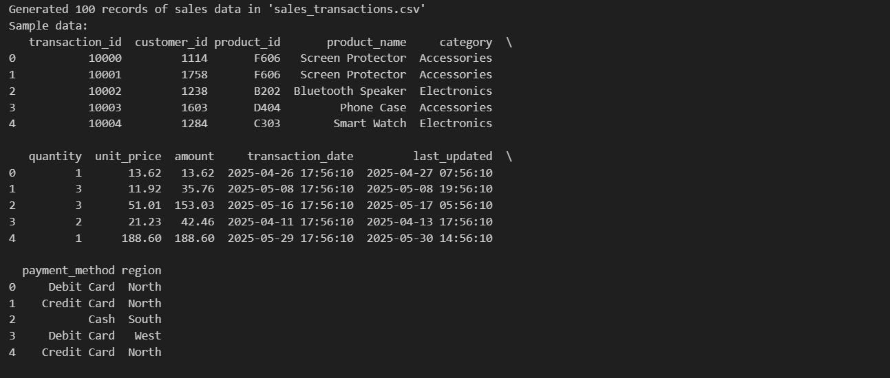
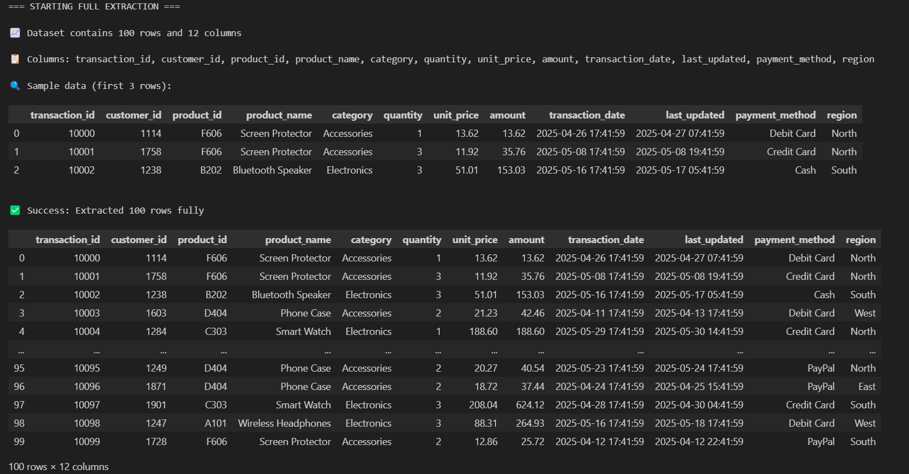
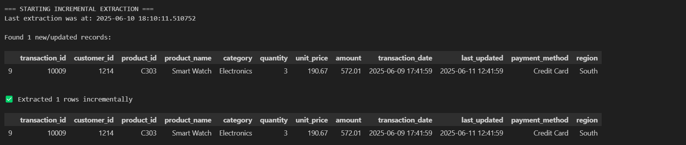
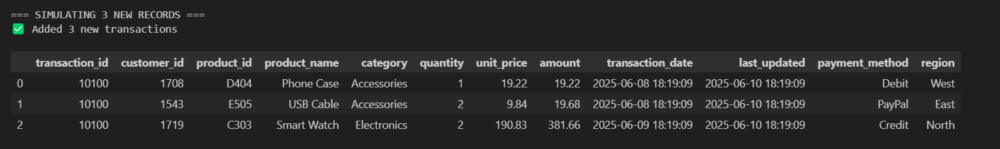

# ETL Extraction Lab - Sales Data Pipeline

**Student Name**: Faith Chakwanira  
**Student ID**: 670435  
**Submission Date**: [10th june 2025]

## 📌 Project Overview
This project demonstrates Extract-Transform-Load (ETL) operations focusing on **full** and **incremental** data extraction patterns. Implemented in Python using Jupyter Notebook, it processes synthetic sales transaction data to showcase real-world ETL workflows.

## 🛠️ Tools & Technologies
- **Python 3**
- **Pandas** (Data manipulation)
- **Jupyter Notebook** (Interactive development)
- **Git/GitHub** (Version control)

## 📂 Project Structure

## 🧩 Key Features
1. **Full Extraction**:
   - Loads complete dataset (100+ records)
   - Displays dataset statistics
   - Saves initial extraction timestamp

2. **Incremental Extraction**:
   - Detects new/updated records since last run
   - Uses `last_updated` timestamps for delta detection
   - Preserves extraction history in `last_extraction.txt`

3. **Data Simulation**:
   - Automated generation of new test records
   - Demonstrates real-world data pipeline scenarios

## 🚀 How to Run
1. **Prerequisites**:
   ```bash
   pip install pandas jupyter

   Clone the Repo
   Run "etl_extract.ipynb"

## The Images:

# Generate 100 records


# complete extraction of all data


# incremental_extraction


# simulate_new_data

